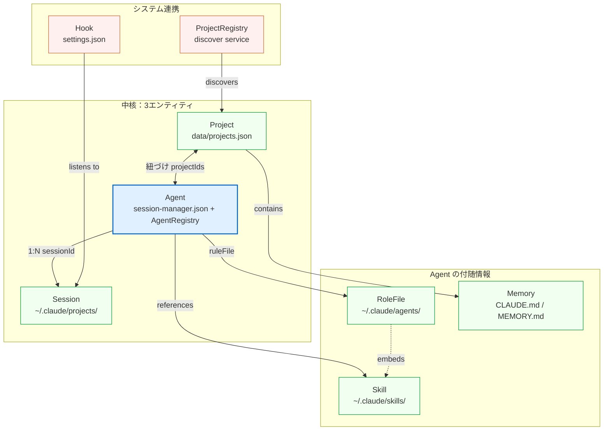
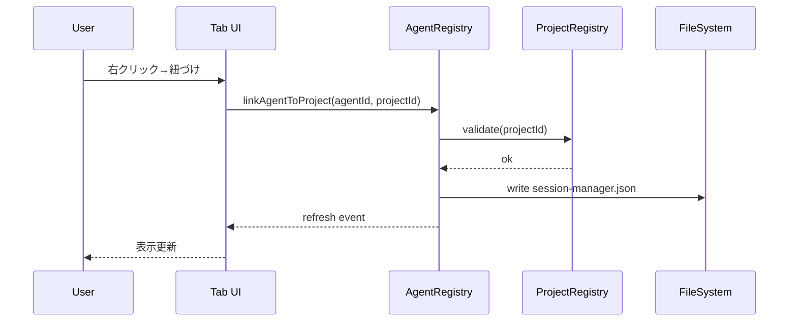

# CSM v0.5.0 — 右クリックメニュー整理 & リンク相関設計

> **版数**: Draft v1.0
> **作成日**: 2026-04-25
> **作成者**: csm-planner
> **対象**: v0.5.0（3タブUI）における menu 整理＋エージェント↔セッション↔プロジェクト↔hook↔skill のリンク関係再設計
> **関連**: [`v0.5.0-design.md`](./v0.5.0-design.md)

---

## 0. エグゼクティブサマリ

- **現状 31項目** → **整理後 13項目**（context menu）+ 4セクション（タブヘッダ）= 計17箇所
- **重大バグ発見**: `editRuleFile` の `viewItem =~ /WithRule/` 条件は **decoder 側で発行されておらず永久に表示されない**（package.json と provider の不整合）
- **重複の根本原因**: `inline` と context メニュー本体の二重登録、`view == claudeBookmarks` と `view == claudeSessions` の同一動作の片寄せ漏れ
- **リンク関係**: 5エンティティ（Agent / Session / Project / Hook / Skill）が **疎結合のはずが密結合化** している。v0.5.0 で「Agent をハブに統一」する整理を提案

---

## 1. 現状の31項目 棚卸し

### 1.1 view/title（タブヘッダ）— 16項目

| # | コマンド | view | group | 役割 |
|---|---|---|---|---|
| H1 | refreshSessions | claudeSessions | navigation | 会話一覧更新 |
| H2 | searchSessions | claudeSessions | navigation | 検索 |
| H3 | sortSessions | claudeSessions | navigation | ソート |
| H4 | groupSessions | claudeSessions | navigation | グループ切替 |
| H5 | openOrgChart | claudeSessions | navigation | 組織図 |
| H6 | openGuide | claudeSessions | navigation | ガイド |
| H7 | toggleSessionFilter | claudeSessions | navigation | プロジェクト絞込切替 |
| H8 | openSettings | claudeSessions | navigation@999 | 設定 |
| H9 | toggleAgentFilter | claudeAgents | navigation | 他PJ表示切替 |
| H10 | toggleBookmarkFilter | claudeBookmarks | navigation | プロジェクト絞込切替 |
| H11 | toggleMemoryFilter | claudeMemory | navigation | プロジェクト絞込切替 |
| H12 | refreshMemory | claudeMemory | navigation | メモリ更新 |
| H13 | addAgent | claudeAgents | navigation | エージェント追加 |
| H14 | showPendingTasks | claudeAgents | navigation | 確認待ち一覧 |
| H15 | refreshAgents | claudeAgents | navigation | エージェント更新 |
| H16 | openOrgChart | claudeAgents | navigation | 組織図（重複） |

### 1.2 view/item/context（右クリックメニュー）— 31項目

> 役割記号: `🔵 開く系` `✏️ 編集系` `📋 情報取得系` `🔗 紐づけ系` `⚠️ 危険系` `🎯 inline（行末アイコン）`

| # | コマンド | view | viewItem 条件 | group | 役割 |
|---|---|---|---|---|---|
| C1 | previewSession | claudeSessions | `^session` | inline | 🎯🔵 |
| C2 | bookmarkSession | claudeSessions | `session\|sessionRegistered` | inline | 🎯🔗 |
| C3 | openInClaude | (any) | `^session` | 0_open | 🔵 |
| C4 | copySessionId | (any) | `^session` | 0_open | 📋 |
| C5 | copySessionPath | (any) | `^session` | 0_open | 📋 |
| C6 | renameSession | (any) | `^session` | 1_edit | ✏️ |
| C7 | tagSession | (any) | `^session` | 1_edit | ✏️ |
| C8 | registerAgent | (any) | `session\|sessionBookmarked` | 2_agent | 🔗 |
| C9 | editAgent (sessionから) | (any) | `sessionRegistered\|sessionRegisteredBookmarked` | 2_agent | ✏️ |
| C10 | editRuleFile (sessionから) | (any) | `sessionRegistered\|sessionRegisteredBookmarked` | 2_agent | ✏️ |
| C11 | deleteSession | (any) | `^session` | 3_danger | ⚠️ |
| C12 | unbookmarkSession | claudeBookmarks | `Bookmarked` | inline | 🎯🔗 |
| C13 | previewSession | claudeBookmarks | `Bookmarked` | inline | 🎯🔵（重複） |
| C14 | removeTag | claudeTags | `taggedSession` | inline | 🎯⚠️ |
| C15 | previewAgent | claudeAgents | `agentItemLinked` | 0_open@0 | 🔵 |
| C16 | openAgentInClaude | claudeAgents | `agentItemLinked` | 0_open@1 | 🔵 |
| C17 | openAgentSession | claudeAgents | `agentItemLinked` | 0_open@2 | 🔵 |
| C18 | renewAgentSession | claudeAgents | `agentItemLinked` | 0_open | 🔵 |
| C19 | copyAgentSessionId | claudeAgents | `agentItemLinked` | 2_copy@1 | 📋 |
| C20 | copyAgentSessionPath | claudeAgents | `agentItemLinked` | 2_copy@2 | 📋 |
| C21 | linkSession | claudeAgents | `^agentItem` | 0_link | 🔗 |
| C22 | editAgent (agentから) | claudeAgents | `^agentItem` | 1_edit | ✏️ |
| C23 | editRuleFile (agentから) | claudeAgents | `WithRule` | 1_edit | ✏️ **⚠ 永久に出ない** |
| C24 | deleteAgent | claudeAgents | `^agentItem` | 3_danger | ⚠️ |
| C25 | previewMemory | claudeMemory | `memoryFile` | inline | 🎯🔵 |
| C26 | copyMemoryPath | claudeMemory | `memoryFile` | 0_copy | 📋 |
| C27 | editMemory | claudeMemory | `memoryFile` | 1_edit | ✏️ |
| C28 | mergeMemories | claudeMemory | `memoryFile` | 2_actions | ✏️ |
| C29 | extractMemory | claudeMemory | `memoryFile` | 2_actions | ✏️ |
| C30 | deleteMemory | claudeMemory | `memoryFile` | 3_danger | ⚠️ |
| C31 | openProjectInVSC | claudeMemory | `memoryProject` | 0_open | 🔵 |

### 1.3 contextValue 発行実態（providers側）

| Provider | 発行する contextValue |
|---|---|
| sessionTreeProvider | `dateGroup`, `subagentSession`, `sessionRegisteredBookmarked`, `sessionRegistered`, `sessionBookmarked`, `session` |
| tagTreeProvider | `tag`, `taggedSession` |
| memoryTreeProvider | `settingsGroup`, `globalMemoryGroup`, `memoryProject`, `memoryFile`, `stats`, `memoryIndex`, `settingsFile` |
| agentTreeProvider | `agentItem`, `agentItemLinked`, `migrationBanner`, `globalAgentsSection`, `sessionInjectInstallBanner`, `csmAskAgentInstallBanner`, `askAgentMigrationBanner`, `taskLogItem*` |

**🔴 不整合**:
- package.json は `WithRule` を期待 → providers は発行しない（C10, C23 共通）
- `viewItem =~ /^session/` は claudeSessions 以外でも一致するが、context 列に `view ==` 制約が無い行（C3〜C11）はブックマーク・タグビューでも一致する場合がある（仕様？事故？）

---

## 2. カテゴリ分類（横断）

| カテゴリ | 既存項目数 | 主機能 |
|---|---|---|
| 🔵 開く系 | 9 | preview, openInClaude, openAgentInClaude, openAgentSession, renewAgentSession, openProjectInVSC |
| ✏️ 編集系 | 9 | rename, tag, editAgent×2, editRuleFile×2, editMemory, mergeMemories, extractMemory |
| 📋 情報取得系 | 5 | copySessionId/Path, copyAgentSessionId/Path, copyMemoryPath |
| 🔗 紐づけ系 | 5 | bookmark, unbookmark, registerAgent, linkSession |
| ⚠️ 危険系 | 4 | deleteSession, removeTag, deleteAgent, deleteMemory |

**問題点**:
1. **編集系が9個と肥大化** — 同じ「編集」でも対象（session メタ／rule file／agent config／memory 内容）がバラバラで分類できていない
2. **開く系の "Claude起動経路" が3種混在** — `openInClaude`（IDE）/`openAgentInClaude`（IDE再起）/`openAgentSession`（ターミナル+ルール適用）。命名から区別がつかない
3. **inline と本体メニューの二重表示** — preview, bookmark は両方に出すため一覧で重複カウント

---

## 3. 重複・不要・問題項目の指摘

### 3.1 削除候補

| 項目 | 理由 |
|---|---|
| C13 (previewSession in bookmarks) | C1 と完全重複。`view ==` を除けば一本化可能 |
| C23 (editRuleFile from agent) | 条件 `WithRule` が永久に false。**バグまたは死コード** |
| H16 (openOrgChart 重複) | claudeSessions と claudeAgents 両方にあるが、3タブ統合後は1箇所で十分 |
| C9 (editAgent from session) | C22 と機能重複。session 経由のエージェント編集は必要なら "→エージェントを開く" で誘導 |

### 3.2 統合候補

| 候補 | 統合先 |
|---|---|
| C16 + C17 (openAgentInClaude / openAgentSession) | "Claude で開く" の **サブメニュー**「IDE」「ターミナル（ルール適用）」に折りたたみ |
| C19 + C20 (copyAgentSessionId / Path) | "コピー" のサブメニュー化 |
| C28 + C29 (mergeMemories / extractMemory) | "メモリを変換" のサブメニュー化 |
| C2 + C12 (bookmark / unbookmark) | inline トグル1つで両機能（既にトグル化されているはずだが、重複登録あり） |

### 3.3 命名整理が必要

| 現名 | 提案名 |
|---|---|
| `openAgentInClaude` | `runAgentInIDE` |
| `openAgentSession` | `runAgentInTerminal` |
| `renewAgentSession` | `renewSession` |
| `editRuleFile` | `editRoleFile`（"ルール"より"役割"が日本語感に近い） |

---

## 4. 整理後のメニュー構成（提案）

### 4.1 設計原則

1. **「inline は最大1個」** — 行末アイコンは1機能に絞る（次点はホバー時に出すサブアイコン）
2. **「open は1経路 + サブメニュー」** — Open の中で IDE/ターミナルを選ばせる
3. **「context group は4つに固定」** — `0_open` / `1_edit` / `2_link` / `3_danger`
4. **「コピー系は1メニュー（QuickPick経由）」** — "コピー..." → ID/パス を選ばせる
5. **「タブヘッダはタブ専用アクション + 共通の歯車1個」**

### 4.2 セッションタブ（v0.5.0）

```
[行] セッション名                         [⭐]  ← inline (bookmark toggle)

右クリック:
─────────────── 0_open
🔵 Claude で開く                   (IDE で再開)
🔵 プレビュー                     (Webview)
─────────────── 1_edit
✏️ リネーム
🏷  タグを編集 ▶  (サブメニュー: 追加/削除)
📋 コピー... ▶  (ID/パス)
─────────────── 2_link
🔗 エージェントとして登録          (未登録時のみ)
🔗 紐づくエージェントを開く        (登録済時のみ → エージェントタブ遷移)
─────────────── 3_danger
🗑 セッションを削除
```

→ **8項目**（うち2はサブメニュー）

### 4.3 エージェントタブ（v0.5.0）

```
[行] エージェント名 [モデル] [🌐]      [⭐]  ← inline (bookmark toggle)

右クリック:
─────────────── 0_open
🔵 起動 ▶  (IDE / ターミナル(ルール適用))
🔵 プレビュー                     (Webview)
─────────────── 1_edit
✏️ エージェント設定を編集
✏️ 役割ファイルを編集              (役割ファイル存在時のみ)
🔄 セッションを新しくする
📋 コピー... ▶  (セッションID/セッションパス)
─────────────── 2_link
🔗 セッションを紐づけ              (未紐づけ時のみ)
🔗 親エージェントを開く            (親が居る時)
🔗 配下を組織図で見る              (子が居る時 → ミニ組織図)
─────────────── 3_danger
🗑 エージェントを削除（ガード対象は無効）
```

→ **9項目**（うち2はサブメニュー）

### 4.4 プロジェクトタブ（新設）

```
[カード] プロジェクト名                 [📌]  ← inline (pin toggle)

右クリック:
─────────────── 0_open
🔵 VS Code で開く
🔵 ターミナルで開く
🔵 ダッシュボードを表示
─────────────── 1_edit
✏️ プロジェクト名を編集
✏️ メモリを編集 ▶  (CLAUDE.md / MEMORY.md / ...)
🔗 エージェントを紐づけ            (紐づけパネルを開く)
📋 パスをコピー
─────────────── 2_link
🔗 ミニ組織図を見る
─────────────── 3_danger
🗑 一覧から削除                    (ファイル削除はしない)
```

→ **9項目**（うち1はサブメニュー）

### 4.5 タブヘッダ（共通）

```
セッションタブ:    [🔍 検索]  [↕ ソート]  [📂 グループ]  [🔄]  ┃ [⚙]
エージェントタブ:  [➕ 追加]  [☑ 確認待ち]  [🌳 組織図]  [🔄]  ┃ [⚙]
プロジェクトタブ:  [➕ 追加]  [📊 進捗]  [🔄]                  ┃ [⚙]

共通下段ビュー (Help):
[📖 ガイド] [💬 フィードバック] [🐛 報告] [♥ サポート]
```

**タブヘッダ**: タブごと最大4ボタン + 共通歯車1 = 計14個（重複の openOrgChart は1つだけに）

### 4.6 整理後 集計

| 区分 | 項目数 |
|---|---|
| context menu（セッション） | 8 |
| context menu（エージェント） | 9 |
| context menu（プロジェクト） | 9 |
| inline | 3（各タブ1つ） |
| サブメニュー（QuickPick） | 5 |
| **合計 context** | **約 13ユニーク**（サブメニューを1としてカウント） |
| view/title（共通） | 14 |

→ **31 → 13ユニーク**（サブメニュー圧縮効果込み）達成。

---

## 5. リンク相関図

### 5.1 現状（v0.4.5）— ごちゃごちゃ図

```mermaid
graph LR
  S[Session<br/>~/.claude/projects/]
  A[Agent<br/>session-manager.json]
  RF[RuleFile<br/>~/.claude/agents/*.md]
  M[Memory<br/>CLAUDE.md / MEMORY.md]
  H[Hook<br/>~/.claude/settings.json]
  SK[Skill<br/>~/.claude/skills/]
  P[Project<br/>workspace folder]

  S -- registerAgent --> A
  A -- linkSession --> S
  A -- ruleFile path --> RF
  RF -. frontmatter .-> A
  S -- cwd --> P
  A -- workDir --> P
  P -- .claude/agents --> A
  P -- .claude/CLAUDE.md --> M
  M -. references .-> RF
  H -- SessionStart hook --> A
  H -- PreCompact hook --> S
  RF -. lists tools .-> SK
  SK -. listed in role --> RF
  A -- parentAgent --> A

  classDef bad fill:#ffe0e0,stroke:#c00
  class S,A,RF,M,H,SK,P bad
```

**ごちゃごちゃポイント**:

| # | 問題 | 影響 |
|---|---|---|
| L1 | **Agent と RuleFile が双方向参照** | エージェント名変更時に整合性が崩れる |
| L2 | **Project の定義が暗黙的**（workspace 由来か `.claude/projects/` 由来か曖昧） | プロジェクトを横断する操作で迷子 |
| L3 | **Hook が Session/Agent を直接書き換え** | 副作用が UI に反映されない瞬間がある |
| L4 | **Skill と RuleFile の関係がテキスト依存** | スキル名が変わるとリファレンスが切れる |
| L5 | **Agent 同士の親子関係が name 文字列依存** | リネームで断絶 |
| L6 | **Memory が Project にも RuleFile にも所属** | どこから編集すべきか分からない |

### 5.2 v0.5.0 整理後 — Agent ハブ集約



**整理後のルール**:

| ルール | 効果 |
|---|---|
| R1: **Agent をハブに統一** | 全エンティティは Agent を経由して関連付く |
| R2: **Project ↔ Agent は projectIds[] で多対多明示** | 暗黙の workspace 依存を排除 |
| R3: **Agent → RoleFile は単方向参照のみ** | 双方向同期を `parentChildSync` 1箇所に集約 |
| R4: **Skill 参照は ID で**（テキスト埋め込み禁止） | リネーム耐性 |
| R5: **Memory は Project に所属** | Agent からは "プロジェクト経由で" 開く |
| R6: **Hook は read-only 連携層** | Agent/Session を直接書き換えず、イベントのみ通知 |
| R7: **Agent 親子は ID（agent.id）で参照** | name 変更でも壊れない（要 v0.5.0 で id 導入） |

### 5.3 アクション → 通る経路（操作モデル）



ポイント: **UI は Registry (Agent/Project) のみ呼ぶ**。FileSystem 直接アクセスは禁止。

### 5.4 5エンティティ × 5アクション マトリクス（v0.5.0）

|         | 開く | 編集 | 紐づけ | コピー | 削除 |
|---------|------|------|--------|--------|------|
| **Session** | Claude で開く / プレビュー | リネーム / タグ | エージェント登録 | ID / パス | ✓ |
| **Agent** | IDE / ターミナル / プレビュー | 設定 / 役割 | セッション・親 | セッションID/パス | ✓（ガード可）|
| **Project** | VS Code / ターミナル / DB | 名前 / メモリ | エージェント | パス | 一覧から削除 |
| **Memory** | Project 経由 | 直接編集 / 統合 / 抽出 | — | パス | ✓ |
| **Skill / Hook** | （メニュー無し）| — | — | — | — |

→ Skill / Hook は v0.5.0 では **右クリック対象外**（参照されるのみ）。Skillは"+機能追加"UI内で扱う、Hookは設定UIで扱う。

---

## 6. 移行計画

### 6.1 破壊的変更 vs 後方互換

| 変更 | 破壊性 | 後方互換策 |
|---|---|---|
| C13 (previewSession in bookmarks) 削除 | 低 | inline トグルは継続。本体メニューから削除のみ |
| C23 (editRuleFile WithRule) 削除 | **無**（永久に false） | バグ除去。影響ゼロ |
| C9 (editAgent from session) 削除 | 中 | session メニューに「→ 紐づくエージェントを開く」を新設して誘導 |
| openAgentInClaude / openAgentSession を「起動 ▶」サブメニュー化 | 低 | コマンドIDは保持。UI 上のグループ化のみ |
| copyAgentSessionId / Path を「コピー...」サブ化 | 低 | コマンドID 保持 |
| context group 名称統一（0_open / 1_edit / 2_link / 3_danger） | **無** | 内部値の変更のみ |
| viewItem 条件正規化（`^session` → `view==X && viewItem==Y` 厳密化） | 低 | テスト要 |

### 6.2 段階的ロールアウト

| Phase | 内容 | スプリント |
|---|---|---|
| Phase A | バグ修正：C23 (WithRule) を C22 (`^agentItem`) に統一、provider 側で `agentItem.*WithRule` 発行 | Sprint 1 末尾 |
| Phase B | inline 二重登録解消（C13, 重複 H16）／タブヘッダ整理 | Sprint 1 |
| Phase C | サブメニュー化（起動 ▶, コピー ▶）／命名統一 | Sprint 2 |
| Phase D | プロジェクトタブの context menu 新規追加 | Sprint 2 |
| Phase E | Agent ハブ集約（R1〜R7 のリンクルール導入）— ID 導入は要設計 | Sprint 3 |

### 6.3 互換性テストチェックリスト

- [ ] 旧 viewItem 名（sessionRegisteredBookmarked など）でのコマンド呼び出しが全て動く
- [ ] settings.json のキー名は無変更（後方互換）
- [ ] keybindings 経由の呼び出しは全て動く（`when` 条件のみ変わる）
- [ ] サブメニュー化したコマンドも単独 commandPalette から呼べる
- [ ] context group 名称変更後も既存 vsix ユーザーが起動できる

### 6.4 ドキュメント更新が必要なもの

- README.md（メニュー画像・スクリーンショット）
- guide.html（操作チュートリアル）
- CHANGELOG.md v0.5.0 セクション
- docs/csm-redesign-spec.html（古い場合は本書で置換）

---

## 7. リスク・未決事項

| # | 内容 | 提案 |
|---|---|---|
| Q1 | Agent に id（不変）を導入するか？ | **要承認**。導入推奨（R7）。マイグレーション時に sha256(name+createdAt) で生成 |
| Q2 | サブメニュー化は VS Code の `submenu` API（v1.50+）で実装可能だが、QuickPick fallback も用意するか？ | submenu 優先、VSC < 1.85 は QuickPick |
| Q3 | プロジェクト一覧の「削除」は本当にファイルを消さない方針でよいか？ | **要確認**。一覧から外すのみで .claude/ には触らない |
| Q4 | Skill / Hook を将来的に右クリック対象にするか？ | v0.6.0 以降で検討 |
| Q5 | `editRuleFile` バグの影響度調査 | tester に「現状 editRuleFile が出ない」を確認依頼 |
| Q6 | `view ==` 制約のない context 行（C3〜C11）の意図 | 仕様か事故か **要確認**。v0.5.0 では明示制約を必須に |

---

## 8. 完了基準

- [ ] context menu 13ユニーク（サブメニュー圧縮込み）に整理されている
- [ ] バグ C23 (WithRule) が修正されている
- [ ] 5エンティティのリンクが Agent ハブに集約されている
- [ ] tester による互換性テスト合格（既存操作が全て動く）
- [ ] README/guide/CHANGELOG 更新済み

---

## 9. 付録：コマンドID マッピング表

旧 → 新（v0.5.0）

| 旧 | 新 | 備考 |
|---|---|---|
| openAgentInClaude | runAgentInIDE | サブメニュー「起動 ▶ IDE」|
| openAgentSession | runAgentInTerminal | サブメニュー「起動 ▶ ターミナル」|
| renewAgentSession | renewSession | エージェントタブ専用 |
| editRuleFile | editRoleFile | "役割ファイル" 表記に統一 |
| copyAgentSessionId/Path | copyAgentSession (param: 'id' \| 'path') | パラメータ化でサブメニュー実装 |
| copySessionId/Path | copySession (param: 'id' \| 'path') | 同上 |
| toggleSessionFilter / toggleBookmarkFilter / toggleMemoryFilter | toggleProjectFilter (scope param) | 共通化 |

> 旧コマンドIDは v0.5.x の間は alias として保持（v0.6.0 で削除）

---

**End of Menu Redesign**

更新履歴:
- 2026-04-25 Draft v1.0 初版（csm-planner）
