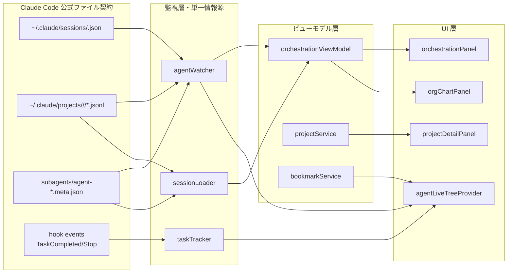

# CSM v0.6.0 — ロードマップ（QA 監査結果を踏まえた今後の設計）

> **版数**: Draft v1.0
> **作成日**: 2026-05-31
> **作成者**: csm-planner
> **対象**: CSM v0.6.0（v0.5.x の整理リファクタ + 独自価値の強化）
> **基礎資料**:
> - [`v0.5.x-cc-compat-qa.md`](./v0.5.x-cc-compat-qa.md)（健全度 78/100、R-1〜R-5）
> - [`v0.5.x-feature-audit.md`](./v0.5.x-feature-audit.md)
> - [`v0.5.x-workflows-integration.md`](./v0.5.x-workflows-integration.md)

---

## 0. エグゼクティブサマリ

### 0.1 v0.6.0 の主題：**「整理 × 独自価値の強化」**

QA は健全度 **78/100** を出したが、これは「主要機能は健全」「ただし `claude agents --json` 連携が死蔵」「ライブ・サブエージェント検出が新ファイル構造を未活用」を意味する。**新機能を盛るより、ファイル契約への一本化と死蔵整理が最大の投資効率**。

### 0.2 v0.6.0 の3本柱

1. **🧹 整理**: `claudeAgentsService`（約 516 行・既定無効・死蔵）を撤去。`sessions/*.json` + `subagents/*.meta.json` 監視に一本化（QA R-1/R-2）
2. **🎯 独自価値の強化**: 履歴/メモリ/組織図/プロジェクト/i18n/ask-agent は公式に無い CSM 固有領域。投資集中
3. **🎼 オーケストレーション可視化の完遂**: Phase 2/3（Webview ガント + 組織図ライブオーバーレイ）を実データ（`kind`/`entrypoint`/`agent`）で実現

### 0.3 重要発見（QA を超える追加エビデンス・2026-05-31 実機確認）

実機 `~/.claude/sessions/<pid>.json` の中身：

```json
{"pid":996658,"sessionId":"20f205ba-...","cwd":"/...","startedAt":1780194475663,
 "procStart":"16952884","version":"2.1.158","peerProtocol":1,
 "kind":"interactive","entrypoint":"claude-vscode","agent":"csm-planner"}
```

→ **`agent`/`entrypoint`/`kind`/`version` まで公式が出している**。CSM 側で推定していたエージェント紐づけ（`agentSessions` マップ）は**公式ファイルから直接取れる**ようになった。これは v0.6.0 の設計を大きく変える。

---

## 1. CSM の存在意義 再定義（ビジョン）

### 1.1 Claude Code 進化後の構図（2026-05 時点）

| 領域 | 公式 (Claude Code) | CSM | 棲み分けの結論 |
|---|---|---|---|
| ライブセッション状態 | `claude agents --json`（TTY必須）+ `sessions/*.json`（ファイル） | `agentWatcher`（JSONL 監視）＋ `claudeAgentsService`（死蔵） | **公式ファイル契約に一本化**（CSM は監視と可視化に集中） |
| バックグラウンド task | `Task` tool / background_tasks hook | `taskTracker`（mtime 推定） | **hook 駆動に置換**（mtime はフォールバック） |
| サブエージェント定義 | エージェント定義は markdown + frontmatter | 同上 + CSM フォーマット | **公式と完全互換維持** |
| サブエージェント実行 | `subagents/agent-*.jsonl` + `meta.json` | `subagentDetector`（旧ヒューリスティック） | **meta.json 優先に切替** |
| 履歴ブラウズ | 無し（CLI内のみ） | `sessionTreeProvider` 他 | **CSM 独占領域** |
| ブックマーク / タグ / リネーム | 無し | `bookmarkTreeProvider` `tagTreeProvider` `customNames` | **CSM 独占領域** |
| メモリ管理（CLAUDE.md/MEMORY.md） | テキスト編集のみ | `memoryTreeProvider` `memoryManager` (merge/extract) | **CSM 独占領域** |
| 組織図（親子・連携の可視化） | 無し（テキスト frontmatter のみ） | `orgChartPanel`（Cytoscape） | **CSM 独占領域** |
| プロジェクト管理（横断ダッシュボード） | 無し | `projectDetailPanel` | **CSM 独占領域** |
| オーケストレーション可視化 | 無し | `orchestrationViewModel`（基盤のみ） | **CSM 独占領域・要強化** |
| i18n（日本語化） | 無し | `i18nService` + 同梱辞書 | **CSM 独占領域** |
| hook 一括管理 | 設定ファイル直接編集 | `hookService`（exec-form 自動移行・最新追従） | **CSM 独占領域** |
| `/csm-ask-agent`（他エージェント呼出） | task tool で可能 | `templates/csm-ask-agent.command.md` | **CSM 独占領域・UX 厚い** |

### 1.2 CSM の核心ミッション（v0.6.0 以降）

> **「Claude Code のマルチエージェント運用を、IDE 内で見える化・操作可能化する司令塔」**

3つの責務：
1. **可視化**：複数のセッション・エージェント・ワークフロー・プロジェクトを VS Code 内で俯瞰
2. **整理**：履歴・メモリ・組織情報を蓄積し再利用可能にする
3. **連携**：エージェント間の橋渡し（`/csm-ask-agent`）と組織情報の自動同期

### 1.3 やらないことの明確化

- CC 公式が CLI で持つ機能を **CLI 経由で呼び直さない**（ファイル契約に追従）
- バックグラウンド task 実行ロジックを **自前で持たない**（hook 駆動）
- LLM API 呼び出しは **i18n 翻訳と利用率プローブのみ**（他は CC に委譲）

---

## 2. 整理マトリクス（撤去 / 寄せる / 改修 / 維持）

QA の R-1〜R-5 と feature-audit の指摘を統合した4分類。

### 2.1 🗑 撤去（デッドコード除去）

| 対象 | 工数 | 優先度 | 根拠 |
|---|---|---|---|
| `src/services/claudeAgentsService.ts` 全体 | 0.5d | **P0** | QA B-1: 既定無効、TTY 必須で IDE から呼べず死蔵（516行） |
| `extension.ts:251-270` の claudeAgentsService 配線 | 0.25d | **P0** | QA B-1 同伴 |
| `package.json` の `claudeAgentsIntegration.*`（4設定キー） | 0.25d | **P0** | 死蔵設定の整理。deprecate 経由で削除 |
| `claudeAgentsService.ts:99-196` 投機的テキストパーサ | （上記同伴） | P0 | QA S-4 |
| `extension.ts:369-370` 未宣言 `detectionMode` リスナー | 0.1d | P1 | QA S-3 |
| effort `'max'` 選択肢（types.ts L94 / agentFormPanel L652-655） | 0.25d | P1 | QA S-1（要 CC 実機確認後） |

**撤去合計**: 約 **1.35 人日**。これだけで package.json と src/ が大幅にスリム化。

### 2.2 🔁 公式に寄せる（ファイル契約追従）

| 対象 | 工数 | 優先度 | 根拠 |
|---|---|---|---|
| `agentWatcher` が `~/.claude/sessions/<pid>.json` を読込 | 1.0d | **P0** | QA R-1。`SessionMeta` 型 (types.ts L27-34) 既存利用 |
| `agentWatcher` が `kind` / `entrypoint` / `version` / `agent` を states に保持 | 0.5d | **P0** | QA R-1。`agent` フィールド活用は本ロードマップで追加発見 |
| `orchestrationViewModel` の `kind` 供給元を agentWatcher に変更 | 0.5d | **P0** | QA B-2 解消。interactive/background が実データで動く |
| サブエージェント検出を `subagents/agent-*.meta.json` 優先に | 0.75d | **P1** | QA R-2。`sessionLoader.readSubagentMeta` 既存知見流用 |
| エージェント名→セッション紐づけを `sessions/*.json` の `agent` フィールドから補完 | 0.5d | **P1** | QA 追加発見。`agentSessions` マップの権威ソース化 |
| タスク状態を `TaskCompleted` / `Stop` hook で確定 | 1.0d | **P2** | QA R-4。mtime 閾値はフォールバック降格 |
| haiku モデル ID をエイリアス化（`usageMonitor` `i18nService`） | 0.25d | **P2** | QA S-2 |
| 生成メモリ本文の `agents[]` → `agentSessions` 文言更新 | 0.1d | P3 | QA S-6 |

**寄せ合計**: 約 **4.6 人日**。

### 2.3 🔧 改修（独自価値の強化）

| 対象 | 工数 | 優先度 | 根拠 |
|---|---|---|---|
| オーケストレーションタブ Phase 2（Webview ガント／ツリー） | 5.25d | **P1** | `v0.5.x-workflows-integration.md` §11.4。実データ（kind）で価値が出る |
| オーケストレーションタブ Phase 3（組織図ライブオーバーレイ） | 2.0d | **P1** | 同上。実データで動く |
| メニュー再設計 v2（claudeAgents/Favorites の重複登録解消） | 3.0d | **P1** | `v0.5.x-menu-redesign-2.md` を完遂 |
| 自動テスト追加（sessions/*.json パース・subagent meta・cliBuilder） | 2.0d | **P2** | QA B-5。CC バージョン破壊検知の最小スイート |
| Plugins 連携でスニペット拡充（`claude plugin list --json`） | 2.0d | **P3** | feature-audit 3.4.2 |
| usageMonitor を「世代 × effort 平均」モデルに刷新 | 2.0d | **P3** | feature-audit 4 |
| 設定キーの 3 カテゴリ再編（`claudeManager.ui.*` `live.*` `agents.*`） | 1.0d | **P3** | feature-audit 4.3 |

**改修合計**: 約 **17.25 人日**。

### 2.4 ✅ 維持（変更不要・健全）

| 対象 | 状態 | 備考 |
|---|---|---|
| `hookService.ts` exec-form 自動移行 | ◎ | 2.1.139+ 追従済 |
| `MessageDisplay` スタブ | ◎ | 2.1.152+ 追従済 |
| `desktopNotification` = terminalSequence | ◎ | 2.1.141+ 連携済 |
| `sessionService.resolveClaudeExec` | ◎ | Windows `claude.exe`(2.1.113+) / `cli.js` フォールバック + CVE-2024-27980 回避 |
| `cliBuilder.modelCliMap` エイリアス | ◎ | リリース追従コストゼロの優れた設計 |
| 履歴/ブックマーク/タグ/リネーム/メモ | ◎ | CSM 独占領域、新構造（subagents/meta.json）も対応済 |
| メモリ管理 (merge/extract/edit) | ◎ | 独自価値、変更不要 |
| 組織図 (Cytoscape + ELK) | ◎ | 独自価値、Phase 3 で強化 |
| プロジェクト管理 (合成定義) | ◎ | 独自価値、変更不要 |
| i18n (同梱辞書 + 自動翻訳 + キャッシュ) | ◎ | 独自価値、辞書拡充は別途 |
| `/csm-ask-agent` (`run_in_background` 採用) | ◎ | QA: 「nohup 懸念は該当なし」確定。誤った課題設定を排除 |

---

## 3. v0.6.0 ロードマップ（Sprint 分割）

### Sprint 1：整理 & ファイル契約一本化（**P0**） — 2週間

**ゴール**: 死蔵コード除去、`sessions/*.json` への一本化、健全度 78 → 88 へ。

| Task ID | 内容 | 工数 |
|---|---|---|
| T6-1.1 | `claudeAgentsService.ts` 撤去 + 配線除去 | 0.75d |
| T6-1.2 | `package.json` の `claudeAgentsIntegration.*` deprecate→削除 | 0.25d |
| T6-1.3 | `agentWatcher` が `sessions/<pid>.json` 全フィールド読込 | 1.0d |
| T6-1.4 | `kind`/`entrypoint`/`agent`/`version` を states に追加（型は `SessionMeta` 既存） | 0.5d |
| T6-1.5 | `orchestrationViewModel` の kind 供給元を agentWatcher に変更（B-2 解消） | 0.5d |
| T6-1.6 | `sessions/*.json` の `agent` フィールドで `agentSessions` を権威化 | 0.5d |
| T6-1.7 | `subagentDetector` を `subagents/agent-*.meta.json` 優先に | 0.75d |
| T6-1.8 | 陳腐化トークン掃除（S-1 effort max / S-2 haiku ID / S-3 detectionMode / S-6 生成メモリ文言） | 0.75d |
| T6-1.9 | 単体テスト追加：`sessions/*.json` パーサ / subagent meta 解析 | 1.5d |
| T6-1.10 | feature-audit.md 追補（QA R-5） | 0.25d |
| T6-1.11 | Sprint 1 動作確認 + リリース判定 | 0.5d |

**Sprint 1 合計**: 約 **7.25 人日**。

### Sprint 2：オーケストレーション可視化 完遂（**P1**） — 2.5週間

**ゴール**: ライブ実データで Webview ガント + 組織図オーバーレイ完成。

| Task ID | 内容 | 工数 |
|---|---|---|
| T6-2.1 | オーケストレーション Phase 2 (案A Webview ガント／ツリー) T7.8〜T7.13 | 5.25d |
| T6-2.2 | オーケストレーション Phase 3 (案C 組織図ライブオーバーレイ) T7.14〜T7.17 | 2.0d |
| T6-2.3 | メニュー再設計 v2 を完遂（重複登録解消・サブメニュー化） | 3.0d |
| T6-2.4 | タスク状態を hook 駆動へ（R-4） | 1.0d |
| T6-2.5 | Sprint 2 動作確認 + KPI 計測（100×20 < 3s / 60fps） | 1.0d |

**Sprint 2 合計**: 約 **12.25 人日**。

### Sprint 3：拡充・テスト・リリース（**P2/P3**） — 1.5週間

| Task ID | 内容 | 工数 |
|---|---|---|
| T6-3.1 | Plugins 連携でスニペット拡充 | 2.0d |
| T6-3.2 | i18n 辞書 60 → 200 件拡充（自動翻訳活用） | 1.0d |
| T6-3.3 | 設定キーの 3 カテゴリ再編（migration 付き） | 1.0d |
| T6-3.4 | テストスイート整備（cliBuilder / sessions json / subagent meta） | 1.5d |
| T6-3.5 | usageMonitor の世代×effort 刷新（P3） | 2.0d |
| T6-3.6 | README / guide.html / CHANGELOG 更新 | 0.5d |
| T6-3.7 | vsix ビルド + リリースノート + tag | 0.5d |

**Sprint 3 合計**: 約 **8.5 人日**。

### 総合工数

| Sprint | 内容 | 工数 |
|---|---|---|
| Sprint 1 | 整理 & ファイル契約一本化 | 7.25 d |
| Sprint 2 | オーケストレーション完遂 | 12.25 d |
| Sprint 3 | 拡充・テスト・リリース | 8.5 d |
| **合計** | | **約 28 人日** |

実装担当を csm-impl / csm-ui / csm-impl-light に分担すれば **約 5〜6 週間** での v0.6.0 リリースが可能。

---

## 4. アーキテクチャ提言（責務分担）

### 4.1 ライブ監視層の整理（Before / After）

#### Before（v0.5.x 現状）

```
┌──────────────────────────────────────────────┐
│  agentLiveTreeProvider / orchestrationViewModel │
└──────┬─────────────────────────────┬──────────┘
       │                             │
       ▼                             ▼
┌────────────────┐         ┌─────────────────────┐
│ agentWatcher   │         │ claudeAgentsService │ ← 死蔵 (516行)
│ (JSONL監視)    │         │ (TTY必須・既定無効) │
└────────────────┘         └─────────────────────┘
       │                             │
       ▼                             ▼
   ~/.claude/projects/*.jsonl     `claude agents --json`
                                  （TTY 必須・呼べない）
```

問題：2 つの監視層が並列に存在し、片方は死蔵。`kind`/`entrypoint` が取れない。

#### After（v0.6.0 提案）

```
┌──────────────────────────────────────────────────┐
│  agentLiveTreeProvider / orchestrationViewModel │
│     +  orchestrationPanel (Phase 2 Webview)     │
│     +  orgChartPanel (Phase 3 ライブオーバーレイ) │
└────────────────────┬─────────────────────────────┘
                     │
                     ▼
              ┌──────────────────┐
              │  agentWatcher    │  ← 一本化
              │  (file-contract) │
              └──────┬─────┬─────┘
                     │     │
        ┌────────────┘     └──────────────┐
        ▼                                  ▼
~/.claude/sessions/<pid>.json    ~/.claude/projects/<proj>/<sid>/
  ・pid / sessionId / cwd        ・*.jsonl (会話履歴)
  ・startedAt / version          ・subagents/agent-*.meta.json
  ・kind / entrypoint / agent       (agentType / description)
                                 ・subagents/agent-*.jsonl
                                 [+ task hook events]
```

利点：
- 監視層は agentWatcher の **1 本**
- データソースは **公式が吐く 3 ファイル + hook イベント**
- TTY 不要、追加プロセス不要
- `kind`/`entrypoint`/`agent` フィールド活用で workflow 判別が実データで動く

### 4.2 サービス層の責務分担表

| 層 | サービス | 責務 | 入力 | 出力 |
|---|---|---|---|---|
| 監視 | `agentWatcher` | ライブ状態の単一情報源 | sessions/*.json + JSONL mtime + subagents/meta.json | `AgentWatcherState` |
| 監視 | `subagentDetector` | 個別ライブ subagent 判定（agentWatcher の補助） | meta.json 優先・ヒューリスティック fallback | `SubagentInfo[]` |
| 監視 | `taskTracker` | タスク状態管理 | hook イベント主・mtime fallback | `TaskLog[]` |
| 解析 | `sessionLoader` | 履歴 JSONL → ParsedSession 変換 | JSONL + subagents meta | `ParsedSession[]` |
| 解析 | `orchestrationViewModel` | workflow / dispatch tree 構築 | agentWatcher + sessionLoader | `OrchestrationView` |
| 集約 | `projectService` | プロジェクト合成定義 | workspace + claude-projects + manual | `ProjectDef[]` |
| 集約 | `bookmarkService` | ブックマーク・最終使用日 | data files | `BookmarkRecord[]` |
| UI | `*TreeProvider` | VS Code TreeView 提供 | 上記サービス | TreeItem |
| UI | `*Panel` | Webview 提供 | 上記サービス | Webview HTML |
| 連携 | `hookService` | hook 一括管理（exec-form） | settings.json | 副作用 |
| 連携 | `i18nService` | 多言語化 | 同梱辞書 + cache + API | 文字列 |

**削除予定（重要）**：
- ❌ `claudeAgentsService.ts` — agentWatcher に統合
- ❌ `claudeAgentsService` 由来の設定キー4種 — package.json から削除

### 4.3 データフロー図（v0.6.0 想定）



---

## 5. v0.6.0 → v0.7.0 への布石（中長期）

| 中期テーマ | 内容 | 想定時期 |
|---|---|---|
| プラグイン経由スニペット拡充 | `claude plugin list --json` 連携、snippet 自動補完 | v0.6.0〜0.7.0 |
| メモリの双方向同期 | CSM 編集 → memory:project API への反映（公式 API 待ち） | v0.7.0 |
| エージェント間通信の可視化 | task tool の input/output トランスクリプト表示 | v0.7.0 |
| `/csm-ask-agent` を hooks ベース化 | 完了通知を SubagentStop hook で確実化 | v0.7.0 |
| ワークフロー履歴永続化 | sqlite or JSON で workflow run を保存 | v0.7.0 |
| 他PC（リモート）監視 | SSH 経由で sessions/*.json を購読 | v0.8.0 |
| プラグイン化 | CSM 自体を `claude plugin install csm` で配布 | v0.8.0+ |

---

## 6. ユーザー判断が必要な論点

| # | 論点 | 提案 |
|---|---|---|
| L1 | **死蔵 `claudeAgentsService` を撤去するタイミング** | v0.6.0 で削除（設定キーは v0.5.x で deprecate 警告→ v0.6.0 で削除）。後方互換のため 1 マイナー版の移行期間を設ける |
| L2 | **`agent` フィールド（sessions/*.json）を権威ソース化する範囲** | 完全置換ではなく「公式が出していれば公式優先、なければ既存 `agentSessions` を維持」のハイブリッドで開始 |
| L3 | **オーケストレーション Phase 2（Webview ガント）の優先度** | QA は「整理優先」を推奨。Sprint 2 で着手するが、Sprint 1 完了後に **ユーザーがどう使うか試行期間** を1週間設ける |
| L4 | **effort `max` の扱い** | CC 実機で有効性確認後、無効なら除去。**csm-impl が 30 分で確認可能** |
| L5 | **設定キーの 3 カテゴリ再編** | 破壊的変更を伴うため Sprint 3 で migration 付きで実施。読み込み側で旧キーも一定期間サポート |
| L6 | **テストスイートの最小ライン** | sessions/*.json パース・subagent meta・cliBuilder の 3 つは必須。Playwright E2E は v0.7.0 に延期 |
| L7 | **`workspace.workspaceFolders` 不在時の UI** | プロジェクトタブを「グローバル一覧」モードで提供（現状未対応）→ v0.6.0 で対応するか確認 |
| L8 | **CSM のプラグイン化（`claude plugin install csm`）** | v0.6.0 では非対応。v0.7.0 以降の中長期テーマ |

---

## 7. 完了基準

- [ ] Sprint 1 完了：健全度 **78 → 88** 達成（QA 再診断で確認）
- [ ] `claudeAgentsService.ts` 削除済、package.json 設定キー削除済
- [ ] `agentWatcher` が `sessions/*.json` の `kind`/`entrypoint`/`agent` を states に保持
- [ ] `orchestrationViewModel` の workflow 判別が実データで動く
- [ ] Sprint 2 完了：オーケストレーション Phase 2/3 動作・KPI 達成
- [ ] Sprint 3 完了：テストスイート稼働・vsix ビルド済
- [ ] README/guide/CHANGELOG 更新済
- [ ] director 承認

---

## 8. 結論

CSM v0.6.0 は **「整理 × 独自価値の強化」**。新規追加より、QA が示した「ファイル契約への一本化」を完遂することが最大の投資効率。これにより：

- 死蔵コード約 516 行除去 → 保守性向上
- `kind`/`entrypoint`/`agent` 活用 → workflow 判別が実データで動く
- オーケストレーション Phase 2/3 が **実データで価値を出せる**
- 公式 CC との競合を避けつつ、CSM 独自領域（履歴・メモリ・組織図・プロジェクト・i18n）を厚くする

総工数 **約 28 人日 / 5〜6 週間** で v0.6.0 リリース可能。

---

**End of Roadmap**

更新履歴:
- 2026-05-31 Draft v1.0 初版（csm-planner）— QA v0.5.x-cc-compat-qa.md（健全度 78/100, R-1〜R-5）を踏まえた今後設計
